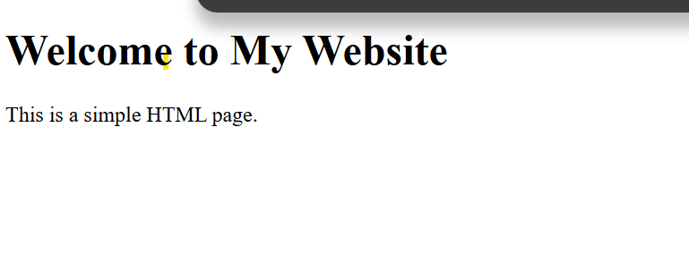

`Commands used`
   50  sudo systemctl stop nginx
   51  sudo apt remove nginx
   52  sudo apt update
   53  sudo apt install nginx
   54  systemctl status nginx
   55  journalctl -u nginx
   56  journalctl -u nginx | head

