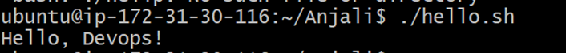
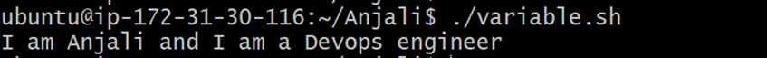
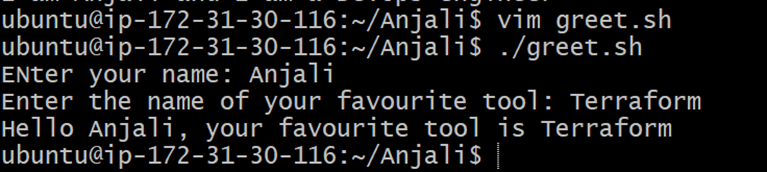
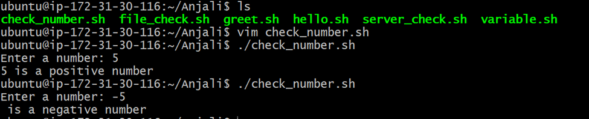
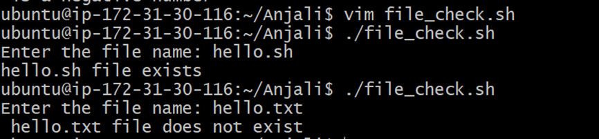
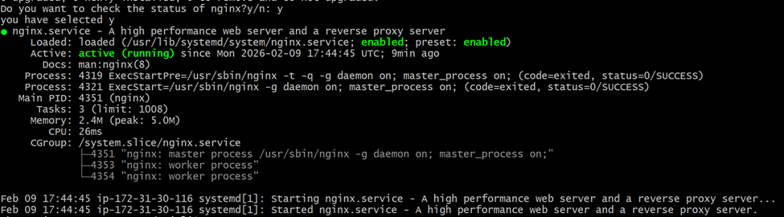

Day 16:
Hello.sh
#!/bin/bash
echo "Hello, Devops!"
output:
 
#===============================================================

Variable.sh
#!/bin/bash

#my first shell script

Name="Anjali"
Role="Devops"

echo "I am $Name and I am a $Role engineer"

output:
 
#==============================================================
Greet.sh
#!/bin/bash

read -p "ENter your name: " Name
read -p "Enter the name of your favourite tool: " Tool

echo "Hello $Name, your favourite tool is $Tool"

Output:
 
#=========================================================== 

Check_number.sh:
#!/bin/bash

read -p "Enter a number: " Num
#num=-5
if [ $Num -lt 0 ]; then
        echo "$num is a negative number"
elif [ $Num -eq 0 ]; then
        echo "$Num is 0"
else
        echo "$Num is a positive number"
fi

Output:

#===========================================================
 
file_check.sh:
#!/bin/bash

read -p "Enter the file name: " filename

if [ -f $filename ]; then
       echo "$filename file exists"
else
        echo " $filename file does not exist"
fi

Output:
 
#===========================================================

Server_check.sh:
#!/bin/bash

service="nginx"
sudo apt-get update
sudo apt install $service
read -p "Do you want to check the status of $service?y/n: " status

echo "you have selected $status"
if [ $status = "y" ]; then
        systemctl status $service
else
        echo "skipped"
fi

Output:
 
#================================================
